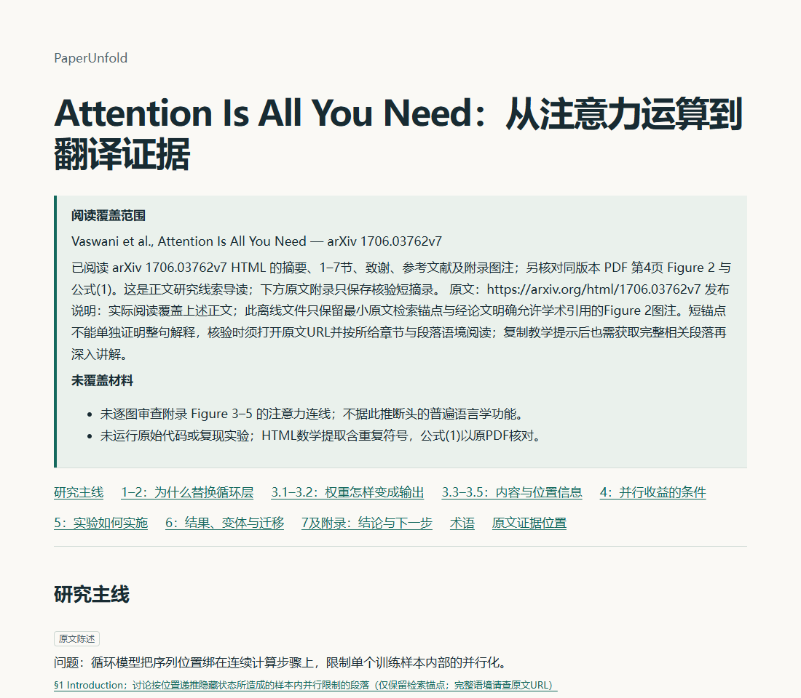

# PaperUnfold

**Understand the paper. Trace the mechanism. Explore the hard parts.**

[English](README.md) · [简体中文](README.zh-CN.md) · [Examples](#examples) · [Installation](#installation) · [Documentation](#documentation)

PaperUnfold is a pair of agent skills for researchers across disciplines. It turns readable papers into visual HTML guides and supports focused teaching through conversation. Explanations follow your conversation language and keep the paper's original terminology.

## Why PaperUnfold?

A summary can name a method without explaining how it works. PaperUnfold connects the research question, intermediate steps, evidence and conclusion. You get an overview first, then enough detail to follow the central mechanism or argument and choose where to go deeper.

| Skill | Purpose | Output |
| --- | --- | --- |
| [`paper-guide`](skills/paper-guide/SKILL.md) | Understand the paper's main thread, mechanism and evidence. | A single-file HTML guide with diagrams, formulas and source links. |
| [`paper-tutor`](skills/paper-tutor/SKILL.md) | Work through a selected concept, mechanism or argument. | Focused dialogue and a saved learning-progress record. |

Use either skill independently, or copy a learning prompt from a guide into your agent conversation.

## Features

- **Mechanism explanations.** Follow inputs, operations, outputs, conditions and the role of each central step.
- **Visual reading.** Method papers use connected pipelines. Empirical and theoretical papers use study-design or argument maps. Relevant formulas and result tables support the explanation.
- **Traceable evidence.** Check claims against observed source locations. Evidence excerpts are folded by default; citation links open the corresponding excerpt.
- **Source-aware coverage.** Accept pasted text, local PDFs, accessible paper webpages, online PDFs and DOI locators. The guide states what was actually read and what is missing.
- **Focused teaching.** Ask a specific question, request a direct explanation, pause, or resume with your progress record and readable source.
- **Portable guides.** Saved HTML embeds its resources, including mathematical rendering, for offline viewing and sharing.



*Actual saved guide for Attention Is All You Need. See the [example and source notes](examples/release09/README.md).*

## Installation

### Requirements

- An agent that can read skill files, access your paper and run the included helpers. Explicit invocation has been verified in **Codex desktop on Windows**.
- **Node.js/npm** for installation through the [Skills CLI](https://github.com/vercel-labs/skills).
- **Python 3.10+** for the helpers; **pypdf 6.x** when extracting PDF text.

### Install from a local checkout

Run from this repository's root to install both skills into the current project:

```powershell
npx skills add . --skill paper-guide paper-tutor --agent codex --copy --yes
```

The installed packages are in `.agents/skills/`. To install into another project, run there and replace `.` with the absolute checkout path. To select one skill, pass only its name after `--skill`.

For PDF input, install the dependency with the Python interpreter your agent will use:

```powershell
python -m pip install -r .agents/skills/paper-guide/requirements.txt
```

### Update

For a local source, rerun the same `npx skills add` command after editing the source. This replaces the installed copies, so keep customizations in the source package.

<details>
<summary>Install and update from GitHub after publication</summary>

Replace `OWNER/REPO` with the published repository address. The remote route is not yet verified for this project.

```powershell
npx skills add OWNER/REPO --skill paper-guide paper-tutor --agent codex --copy --yes
npx skills update paper-guide paper-tutor --project
```

</details>

The Python copy installer is also available. See [installation details](docs/installation.md) for that route, global installs, dependencies and update behavior.

## Usage

Open your target project in Codex and give it readable paper material. These prompts explicitly load the installed entry files.

### Generate a guide

```text
Read .agents/skills/paper-guide/SKILL.md and follow it.
Explain inputs/paper.pdf in English. Include the central mechanism or argument,
its visual structure, key evidence and limits. Save outputs/guide.html.
```

You can replace the PDF path with an accessible paper URL, DOI or pasted passage. Explanations use the conversation language unless you specify another one. The guide starts with the main thread and expands the central steps; detailed appendix audits are available on request.

### Explore a question

```text
Read .agents/skills/paper-tutor/SKILL.md and follow it.
Using inputs/paper.pdf, help me understand how the main evidence supports
its conclusion. Work through one question at a time and wait for my answer.
```

From an HTML guide, expand a chapter or term's teaching panel and copy its prompt into your agent conversation. The page provides the prompt; teaching happens in the agent.

### Pause and resume

```text
Pause and save my learning progress to outputs/learning-progress.json.
```

In a new conversation, provide the progress file and readable paper source:

```text
Read .agents/skills/paper-tutor/SKILL.md and follow it.
Resume from outputs/learning-progress.json using inputs/paper.pdf.
```

A progress record preserves the learning position and demonstrated understanding. It does not replace the paper or establish mastery on its own.

## Examples

Download or open the HTML files locally to view the guides. Each example includes coverage and source information.

| Research structure | Paper | Guide |
| --- | --- | --- |
| Algorithm and mechanism | Attention Is All You Need | [Chinese HTML](examples/release09/algorithm-zh.html) |
| Empirical evidence | Challenging the N-Heuristic | [English HTML](examples/release09/empirical-en.html) |
| Theoretical argument | Why Most Published Research Findings Are False | [Chinese HTML](examples/release09/theory-zh.html) · [English HTML](examples/release09/theory-en.html) |

See the [example collection](examples/release09/README.md), [teaching and resumption record](examples/release09/teaching-session.md), and [same-passage presentation comparison](examples/release09/conventional-comparison.md). These demonstrate the workflow; they do not measure human learning gains or establish quality across every discipline.

## Scope and limitations

PaperUnfold packages instructions and helpers for your agent. Analysis and teaching depend on the agent and the readable source material.

- A DOI or abstract does not establish full-paper access. Missing or unreadable material limits the guide.
- PDF extraction does not perform OCR. Figures, tables and ambiguous equations need source inspection.
- Automatic discovery, Codex CLI execution and other agent/platform combinations have not been verified for this project.
- Interactive experiments currently support a bounded softmax teaching example. Other mechanisms use source-guided diagrams or worked examples.
- Source reuse and targeted checks reduce repeat work. End-to-end speed and learning improvements are not guaranteed.

## Documentation

| Document | Contents |
| --- | --- |
| [Installation](docs/installation.md) | Local and remote installation, dependencies, updates and fallback paths. |
| [npx validation](docs/validation/npx-installation.md) | Actual package discovery, local installation and refresh checks. |
| [Guide workflow](docs/validation/quick-guide.md) | Explanation depth, pipelines and performance-validation limits. |
| [Specification](docs/spec.md) | Behavior contracts and acceptance scenarios. |
| [Design](docs/design.md) | Reading and teaching methodology, in Chinese. |
| [Glossary](CONTEXT.md) | Shared project terminology, in Chinese. |

## Contributing

Contributions to explanation quality, diagrams, source handling and agent compatibility are welcome. See [CONTRIBUTING.md](CONTRIBUTING.md) for observable behavior checks and source-fidelity requirements. Report the source version, agent environment, expected behavior and actual result when describing an issue.

## Acknowledgements

Inspired by [Karpathy's discussion of clear explanations and custom artifacts](https://x.com/karpathy/status/2105819303471976479) and [asd-ste100-skill](https://github.com/danyuchn/asd-ste100-skill). PaperUnfold applies clear terminology, explicit steps and meaning-preserving explanations to paper reading. These projects are references, not runtime dependencies or endorsements.

## License

Original code, skills and documentation are licensed under [MIT](LICENSE). Papers and bundled KaTeX retain their own [licenses and attribution](THIRD_PARTY_NOTICES.md).
