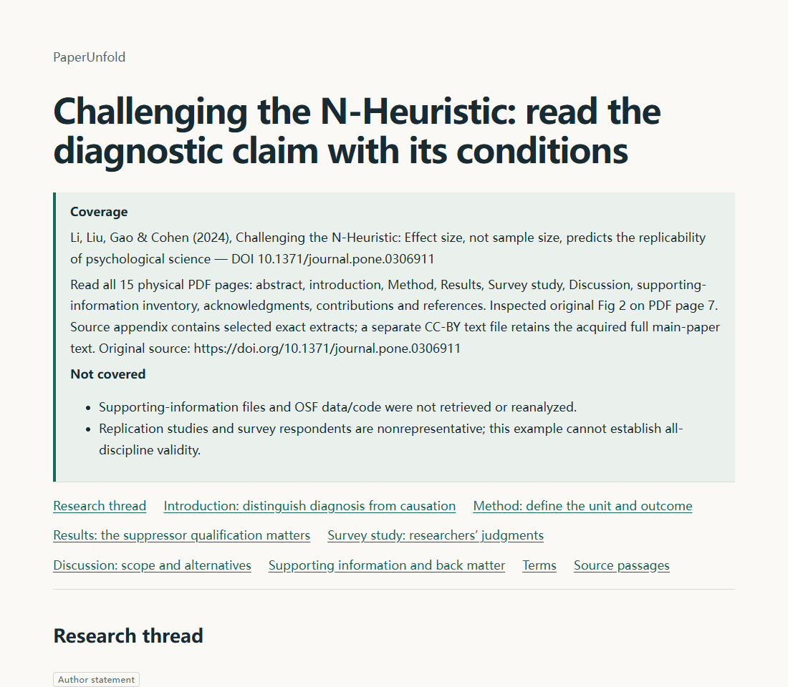

# PaperUnfold

**读清论文主线，拆解核心机制，按需深入理解。**

[English](README.md) · [简体中文](README.zh-CN.md) · [示例](#示例) · [安装](#安装) · [项目文档](#项目文档)

PaperUnfold 是面向全球各学科研究人员的一组 Agent Skill。它将可读论文转为可视化 HTML 导读，并通过对话帮助你深入理解具体问题。讲解跟随对话语言，关键术语保留原文名称。

## 为什么使用 PaperUnfold？

论文摘要可能列出方法名称，却没有解释方法怎样运作。PaperUnfold 将研究问题、中间步骤、证据和结论连起来：先呈现全貌，再展开核心机制或论证，让你知道每一步做什么，以及哪里值得继续深读。

| Skill | 用途 | 输出 |
| --- | --- | --- |
| [`paper-guide`](skills/paper-guide/SKILL.md) | 理解论文主线、机制与证据。 | 单文件 HTML 导读，包含图示、公式与原文定位。 |
| [`paper-tutor`](skills/paper-tutor/SKILL.md) | 深入理解选定概念、机制或论证。 | 聚焦问题的教学对话与学习进度记录。 |

两个 Skill 可以独立使用，也可以从导读中复制学习提示词，进入 Agent 对话继续学习。

## 核心功能

- **机制拆解。** 讲清核心步骤的输入、操作、输出、条件，以及它怎样衔接下一步。
- **可视化阅读。** 方法论文提供带箭头的 pipeline；实证和理论论文按内容提供研究设计图或论证图，并结合必要公式和结果表。
- **原文可追溯。** 关键陈述附实际观察到的原文位置。证据摘录默认折叠，点击引用自动展开对应内容。
- **覆盖范围明确。** 支持粘贴原文、本地 PDF、可访问论文网页、在线 PDF 和 DOI 定位，注明实际读取范围及缺失材料。
- **按需教学。** 围绕具体问题讲解，可要求直接解释、暂停，或结合进度记录与原文在新对话中续学。
- **离线分享。** 导读 HTML 内嵌资源和数学渲染，可离线打开与分享。



*Challenging the N-Heuristic 的实际英文导读页面。参见[示例与来源说明](examples/release09/README.md)。*

## 安装

### 环境要求

- 能读取 Skill 文件、访问论文并执行助手脚本的 Agent。目前已验证 **Windows 上的 Codex 桌面版**明确读取入口文件的方式。
- 使用 [Skills CLI](https://github.com/vercel-labs/skills) 安装时，需要 **Node.js/npm**。
- 助手脚本需要 **Python 3.10+**；提取 PDF 文本另需 **pypdf 6.x**。

### 从 GitHub 安装

在目标项目根目录执行：

```powershell
npx skills add Kstheme/PaperUnfold --skill paper-guide paper-tutor --agent codex --copy --yes
```

安装目录为 `.agents/skills/`。只安装一个 Skill 时，在 `--skill` 后仅保留它的名称。

使用 PDF 输入时，通过 Agent 将使用的 Python 解释器安装依赖：

```powershell
python -m pip install -r .agents/skills/paper-guide/requirements.txt
```

### 更新

```powershell
npx skills update paper-guide paper-tutor --project
```

### 从本地仓库安装

本地开发时，在仓库根目录执行：

```powershell
npx skills add . --skill paper-guide paper-tutor --agent codex --copy --yes
```

安装到其他项目时，在目标项目执行命令，把 `.` 换成仓库绝对路径。修改本地源文件后，重新运行同一条 `add` 命令即可刷新安装副本；它会替换副本，请将定制保存在源目录。

项目也提供 Python 副本安装器。其他安装方式、用户级安装、依赖与更新行为见[完整安装说明](docs/installation.md)。

## 使用

在 Codex 中打开目标项目并提供可读论文。以下提示词会明确加载已安装的入口文件。

### 生成导读

```text
读取 .agents/skills/paper-guide/SKILL.md 并按其执行。
用中文解读 inputs/paper.pdf，讲清核心机制或论证、可视化结构、关键证据和局限。
将 HTML 导读保存到 outputs/guide.html。
```

可以把 PDF 路径换成可访问论文链接、DOI 或粘贴片段。讲解默认跟随对话语言，也可显式指定。导读先给主线，再展开核心步骤；完整附录审计按需进行。

### 深入一个问题

```text
读取 .agents/skills/paper-tutor/SKILL.md 并按其执行。
基于 inputs/paper.pdf，帮助我理解主要证据如何支持论文结论。
每轮推进一个问题，等待我的回答后继续。
```

从 HTML 导读进入教学时，展开章节或术语的教学面板，复制提示词到 Agent 对话中。页面提供交接提示词，教学在 Agent 中进行。

### 暂停与续学

```text
暂停，并将学习进度保存到 outputs/learning-progress.json。
```

在新对话中提供进度文件和可读原文：

```text
读取 .agents/skills/paper-tutor/SKILL.md 并按其执行。
结合 inputs/paper.pdf，从 outputs/learning-progress.json 续学。
```

进度记录保留学习位置与已体现的理解状态，不能替代论文原文，也不会仅因生成记录就判定掌握。

## 示例

下载或在本地打开 HTML 查看。各示例包含覆盖范围与原文来源说明。

| 研究结构 | 论文 | 导读 |
| --- | --- | --- |
| 算法与机制 | Attention Is All You Need | [中文 HTML](examples/release09/algorithm-zh.html) |
| 实证证据 | Challenging the N-Heuristic | [英文 HTML](examples/release09/empirical-en.html) |
| 理论论证 | Why Most Published Research Findings Are False | [中文 HTML](examples/release09/theory-zh.html) · [英文 HTML](examples/release09/theory-en.html) |

另有[示例集合](examples/release09/README.md)、[教学与续学记录](examples/release09/teaching-session.md)和[相同片段的呈现对照](examples/release09/conventional-comparison.md)。这些示例展示工作流程，不代表已测量真实学习效果或验证所有学科的质量。

## 适用范围与限制

PaperUnfold 为 Agent 提供指令包与助手脚本，解读和教学效果取决于 Agent 与可读原文。

- DOI 或摘要不代表取得完整论文；缺失或不可读材料会限制导读范围。
- PDF 提取不提供 OCR；图表与存在歧义的公式需要查看原始材料。
- 本项目尚未验证自动发现、Codex CLI 执行，以及其他 Agent 和系统组合。
- 交互实验目前支持限定范围的 softmax 教学示例；其他机制使用有原文依据的图示或分步示例。
- 通过复用原文与针对性核对减少重复工作，但不保证固定端到端耗时或学习增益。

## 项目文档

| 文档 | 内容 |
| --- | --- |
| [安装说明](docs/installation.md) | 本地与远程安装、依赖、更新及替代路径。 |
| [npx 验证](docs/validation/npx-installation.md) | 实际包发现、本地安装与刷新检查。 |
| [导读流程](docs/validation/quick-guide.md) | 解释深度、pipeline 与性能验证边界。 |
| [规格](docs/spec.md) | 行为约定与验收场景。 |
| [设计](docs/design.md) | 阅读与教学方法论。 |
| [术语表](CONTEXT.md) | 项目的统一术语。 |

## 参与贡献

欢迎改进讲解质量、图示、原文处理与 Agent 兼容性。提交前请阅读 [CONTRIBUTING.md](CONTRIBUTING.md)，核对可见行为与原文忠实度。反馈问题时，附上原文版本、Agent 环境、预期行为和实际结果。

## 致谢

项目受到 [Karpathy 关于清晰讲解与定制产物的讨论](https://x.com/karpathy/status/2105819303471976479)及 [asd-ste100-skill](https://github.com/danyuchn/asd-ste100-skill) 启发，将术语一致、步骤明确和保留原意的原则用于论文阅读。这些项目是参考来源，不是运行依赖，也不代表它们为本项目背书。

## 许可证

原创代码、技能与文档采用 [MIT](LICENSE)。论文和内嵌 KaTeX 保留各自[许可证与署名](THIRD_PARTY_NOTICES.md)。
